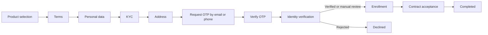

# onboarding-client-g

Onboarding orchestrator driven by JSON interactions.

## Key Decisions

- Modular monolith for simple deployment and operation.
- Java 21 and Spring Boot 3.5.
- API-first design with a versioned OpenAPI contract.
- Explicit workflow in `src/main/resources/interactions/onboarding.json`.
- Persistent state using JPA, Flyway, and optimistic locking.
- Immutable transition history with actor and correlation metadata.
- Idempotent action execution through the `Idempotency-Key` header.
- Versioned consent evidence and a transactional outbox.
- Document filesets and metadata; binary content remains in external object storage.
- H2 for development, MySQL through the `mysql` profile, and PostgreSQL through
  the `postgres` profile.
- External integrations isolated behind ports and adapters.

A generic BPMN engine was intentionally not implemented. The service includes
only the capabilities required by this domain: steps, actions, outcomes, and
transitions.

## Workflow



The development profile uses a dummy OTP adapter. `request-otp` accepts an
`EMAIL` or `PHONE` destination and `verify-contact` accepts the deterministic
code `123456`. This adapter is not suitable for production because delivery,
expiration, attempt limits, and abuse controls must be provided by a real OTP
service.

## Run the Application

Requirements:

- JDK 21
- Maven 3.6.3 or later

```bash
mvn spring-boot:run
```

Check service health:

```bash
curl http://localhost:8080/actuator/health
```

Create a case:

```bash
curl -X POST http://localhost:8080/api/v1/onboarding-cases \
  -H 'Content-Type: application/json' \
  -d '{"workflowKey":"onboarding"}'
```

Retrieve the current interaction:

```bash
curl http://localhost:8080/api/v1/onboarding-cases/{caseId}/interaction
```

## Case Management

Completed onboarding cases enter an independent operational review queue with
status `PENDING`. The Case Manager endpoints provide paginated search, aggregated
case detail, self-assignment, documents, timeline, and audited approval or
rejection. Rejection requires a reason and decisions are accepted only from the
operator assigned to the case.

All routes below `/api/v1/case-management` require a Keycloak bearer token with
the realm role `case-manager`. Prospect onboarding routes remain public by product
decision. Configure JWT validation with `OIDC_ISSUER_URI` and `OIDC_JWK_SET_URI`;
the latter allows containers to obtain keys through the internal Keycloak route
while validating the public token issuer.

Execute its action:

```bash
curl -X POST \
  http://localhost:8080/api/v1/onboarding-cases/{caseId}/actions/select-products \
  -H 'Content-Type: application/json' \
  -d '{"productIds":["checking-account"]}'
```

## PostgreSQL

```bash
export DB_URL='jdbc:postgresql://localhost:5432/onboarding'
export DB_USERNAME='onboarding'
export DB_PASSWORD='change-me'
mvn spring-boot:run -Dspring-boot.run.profiles=postgres
```

Credentials must never be committed. In production, inject them through a
secrets manager.

## Shared MySQL Database

The `mysql` profile connects to the shared MySQL 8.4 database defined at
`../../../docker-compose/windows-docker/docker-compose-database-mysql.yml`.
Its defaults match the Compose configuration: database `app_db`, user
`app_user`, host `localhost`, and port `3306`.

```bash
set -a
source ../../.env
set +a
mvn spring-boot:run -Dspring-boot.run.profiles=mysql
```

Override `DB_URL` or `DB_USERNAME` when the database uses values other than the
Compose defaults. Flyway creates the `onboarding_case` table on the first
connection and Hibernate validates the resulting schema.

The remote `windows-docker` Compose service publishes MySQL only on the remote
loopback interface (`127.0.0.1:3306`). To run this application on the local Mac,
open an SSH tunnel in a separate terminal before starting it:

```bash
ssh -N -L 3306:127.0.0.1:3306 alexi@10.75.104.133
```

The shared `Project/.env` file is ignored by Git and must have restrictive file
permissions. Do not commit the database password or place it directly in YAML.

## Integrate a Biometric Provider

The application depends on `BiometricVerificationPort`, not on a specific SDK.
To integrate an external provider:

1. Create an adapter that implements `BiometricVerificationPort`.
2. Enable it through a property, for example:
   `onboarding.integrations.biometric.provider=external`.
3. Keep credentials, timeouts, retries, and idempotency logic inside the
   adapter.
4. Add contract tests against the provider's sandbox.

The initial `none` adapter returns `MANUAL_REVIEW`, allowing the complete
onboarding flow to be tested without simulating biometric approval.

## Contract and Tests

- OpenAPI: `src/main/resources/static/openapi/onboarding-api.yaml`
- Postman: `postman/collection.json`
- Postman environment: `postman/windows-docker.environment.json`
- Test report: `docs/test-report.md`
- Tests: `mvn test`

The Postman collection contains health checks and three independent scenarios:
successful completion, incomplete/skipped input, and a foreign case ID. Import
the windows-docker environment when using SSH tunnels, run each folder in order,
and select a local PDF manually in request `01.07` before sending it. Scenario
variables, case IDs, file-set IDs, and document IDs are stored automatically.

## Operational Persistence

Flyway V2 adds `onboarding_case_event`, `onboarding_consent`,
`onboarding_idempotency_record`, `onboarding_outbox_event`, `document_file_set`,
and `document_file`. Case updates, audit events, consent evidence, idempotency
results, and outbox events participate in the same database transaction.

Clients should send a unique `Idempotency-Key` for every action with side
effects. `X-Actor-Id` and `X-Correlation-Id` are recorded in the immutable event
history when present.

Flyway V3 adds `onboarding_case_review` and `onboarding_case_review_event`.
Existing completed cases are backfilled as `PENDING`, while newly completed cases
enter the queue in the same onboarding transaction.

The document API registers metadata and an `objectKey`; it intentionally does
not store binary content in MySQL. The object must first be uploaded through the
selected storage adapter (for example S3 or MinIO), and its SHA-256 checksum must
be registered with the metadata.

## Planned Improvements

- Granular permissions for compliance officers and platform administrators.
- Action-specific DTOs and validation.
- Outbox publisher with retries, backoff, and dead-letter handling.
- S3/MinIO document-content adapter and signed upload URLs.
- Duration and abandonment metrics for each step.
