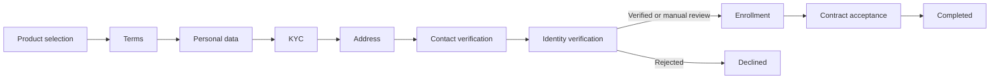

# onboarding-client-g

Onboarding orchestrator driven by JSON interactions.

## Key Decisions

- Modular monolith for simple deployment and operation.
- Java 21 and Spring Boot 3.5.
- API-first design with a versioned OpenAPI contract.
- Explicit workflow in `src/main/resources/interactions/onboarding.json`.
- Persistent state using JPA, Flyway, and optimistic locking.
- H2 for development and PostgreSQL through the `postgres` profile.
- External integrations isolated behind ports and adapters.

A generic BPMN engine was intentionally not implemented. The service includes
only the capabilities required by this domain: steps, actions, outcomes, and
transitions.

## Workflow



## Run the Application

Requirements:

- JDK 21
- Maven 3.6.3 or later

```bash
mvn spring-boot:run
```

Check service health:

```bash
curl http://localhost:8080/actuator/health
```

Create a case:

```bash
curl -X POST http://localhost:8080/api/v1/onboarding-cases \
  -H 'Content-Type: application/json' \
  -d '{"workflowKey":"onboarding"}'
```

Retrieve the current interaction:

```bash
curl http://localhost:8080/api/v1/onboarding-cases/{caseId}/interaction
```

Execute its action:

```bash
curl -X POST \
  http://localhost:8080/api/v1/onboarding-cases/{caseId}/actions/select-products \
  -H 'Content-Type: application/json' \
  -d '{"productIds":["checking-account"]}'
```

## PostgreSQL

```bash
export DB_URL='jdbc:postgresql://localhost:5432/onboarding'
export DB_USERNAME='onboarding'
export DB_PASSWORD='change-me'
mvn spring-boot:run -Dspring-boot.run.profiles=postgres
```

Credentials must never be committed. In production, inject them through a
secrets manager.

## Integrate a Biometric Provider

The application depends on `BiometricVerificationPort`, not on a specific SDK.
To integrate an external provider:

1. Create an adapter that implements `BiometricVerificationPort`.
2. Enable it through a property, for example:
   `onboarding.integrations.biometric.provider=external`.
3. Keep credentials, timeouts, retries, and idempotency logic inside the
   adapter.
4. Add contract tests against the provider's sandbox.

The initial `none` adapter returns `MANUAL_REVIEW`, allowing the complete
onboarding flow to be tested without simulating biometric approval.

## Contract and Tests

- OpenAPI: `src/main/resources/static/openapi/onboarding-api.yaml`
- Postman: `postman/collection.json`
- Test report: `docs/test-report.md`
- Tests: `mvn test`

The Postman collection automatically stores the `caseId` and can be executed
sequentially to run through the complete onboarding flow.

## Planned Improvements

- Authentication and authorization based on the actual consumer.
- Action-specific DTOs and validation.
- Transition auditing without storing sensitive data.
- Idempotency keys for actions with external side effects.
- Duration and abandonment metrics for each step.
