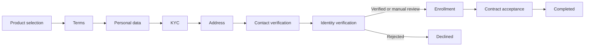

# onboarding-client-g

Orquestador de onboarding dirigido por interacciones JSON.

## Decisiones principales

- Monolito modular para mantener despliegue y operación sencillos.
- Java 21 y Spring Boot 3.5.
- API First con contrato OpenAPI versionado.
- Workflow explícito en `src/main/resources/interactions/onboarding.json`.
- Estado persistente con JPA, Flyway y bloqueo optimista.
- H2 para desarrollo y PostgreSQL mediante el perfil `postgres`.
- Integraciones externas detrás de puertos y adaptadores.

No se implementó un motor BPMN genérico. El servicio solo contiene las capacidades
necesarias para este dominio: pasos, acciones, resultados y transiciones.

## Flujo



## Ejecutar

Requisitos:

- JDK 21
- Maven 3.6.3 o superior

```bash
mvn spring-boot:run
```

Health check:

```bash
curl http://localhost:8080/actuator/health
```

Crear un caso:

```bash
curl -X POST http://localhost:8080/api/v1/onboarding-cases \
  -H 'Content-Type: application/json' \
  -d '{"workflowKey":"onboarding"}'
```

Consultar la interacción actual:

```bash
curl http://localhost:8080/api/v1/onboarding-cases/{caseId}/interaction
```

Ejecutar su acción:

```bash
curl -X POST \
  http://localhost:8080/api/v1/onboarding-cases/{caseId}/actions/select-products \
  -H 'Content-Type: application/json' \
  -d '{"productIds":["checking-account"]}'
```

## PostgreSQL

```bash
export DB_URL='jdbc:postgresql://localhost:5432/onboarding'
export DB_USERNAME='onboarding'
export DB_PASSWORD='change-me'
mvn spring-boot:run -Dspring-boot.run.profiles=postgres
```

No se deben versionar credenciales. En producción deben inyectarse desde un gestor
de secretos.

## Integrar un proveedor biométrico

La aplicación depende de `BiometricVerificationPort`, no de un SDK específico.
Para integrar un proveedor externo:

1. Crear un adaptador que implemente `BiometricVerificationPort`.
2. Activarlo mediante una propiedad, por ejemplo
   `onboarding.integrations.biometric.provider=external`.
3. Mantener credenciales, timeouts, retries e idempotencia dentro del adaptador.
4. Añadir pruebas de contrato contra el sandbox del proveedor.

El adaptador inicial `none` devuelve `MANUAL_REVIEW`, lo que permite probar el
onboarding completo sin simular una aprobación biométrica.

## Contrato y pruebas

- OpenAPI: `src/main/resources/static/openapi/onboarding-api.yaml`
- Postman: `postman/collection.json`
- Reporte de pruebas: `docs/test-report.md`
- Pruebas: `mvn test`

La colección Postman guarda automáticamente el `caseId` y puede ejecutarse
completa en orden para recorrer el onboarding de principio a fin.

## Próximos incrementos

- Autenticación y autorización según el consumidor real.
- DTO y validaciones específicas para cada acción.
- Auditoría de transiciones sin almacenar datos sensibles.
- Idempotency keys para acciones con efectos externos.
- Métricas de duración y abandono por paso.
